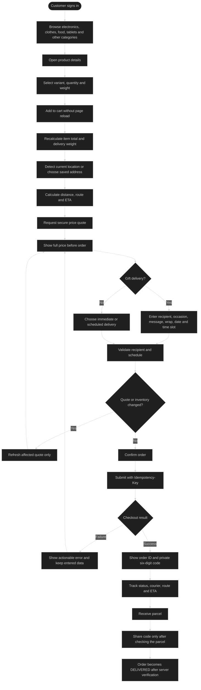
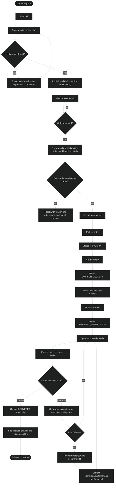
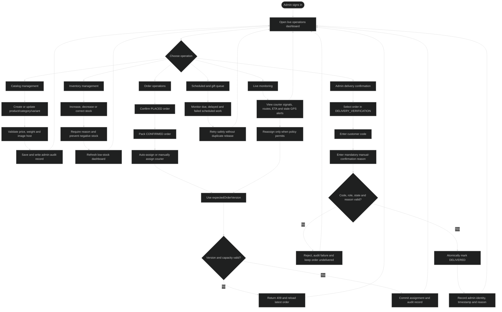
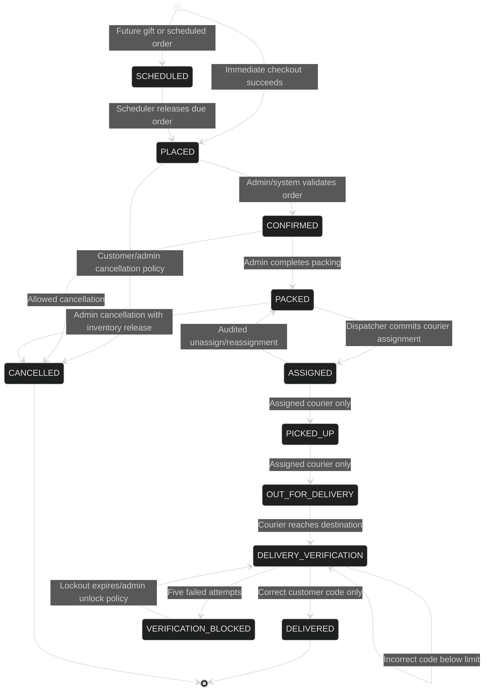
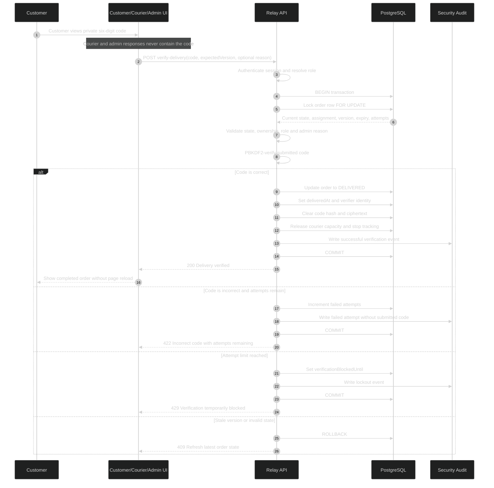
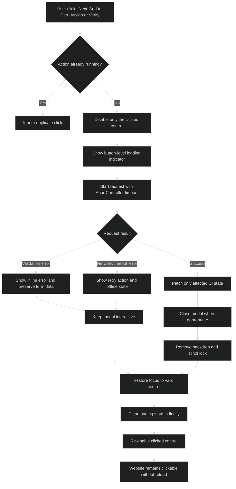

#Relay Market Network

Relay is a three-role marketplace and delivery system built with Java 17, JDBC,
PostgreSQL, and vanilla HTML/CSS/JavaScript. Customers shop database-backed
categories, receive server-priced delivery quotes, schedule gifts, and track the
assigned courier. Agents share location and execute deliveries; admins manage the
catalog, inventory, pricing, assignments, scheduled work, and live signals.

The Java process serves both `/api/*` and `frontend/`, so the normal deployment is
same-origin and needs no separate frontend server.

## Requirements

- Java 17+
- Maven 3.9+
- PostgreSQL 14+
- Node.js 20+ for frontend and HTTP integration checks

On Homebrew macOS, make the keg-only JDK visible first:

```bash
export JAVA_HOME=/opt/homebrew/opt/openjdk@17/libexec/openjdk.jdk/Contents/Home
export PATH="$JAVA_HOME/bin:$PATH"
```

## Database Setup

`schema.sql` is the complete development schema and seed script. It drops Relay
objects before recreating them, so do not run it against a database containing
data that must be retained.

```bash
createdb relay_delivery
psql -d relay_delivery -v ON_ERROR_STOP=1 -f schema.sql
```

For an existing Relay database, apply the additive migration instead. It keeps
users, carts, orders, and inventory intact while adding audit ledgers, optimistic
order versions, and the corrected cart identity sequence:

```bash
psql -d relay_delivery -v ON_ERROR_STOP=1 -f migrations/001_admin_audit_and_sequences.sql
psql -d relay_delivery -v ON_ERROR_STOP=1 -f migrations/002_delivery_verification.sql
```

It seeds 15 categories, 16 products, product variants, six vehicle types, pricing
tiers, coupons, delivery slots, zones, routes, addresses, agents, and sample
orders. The PostgreSQL-specific `CHECK`, partial index, `SKIP LOCKED`, and view
features are intentional.

## Run

```bash
export DB_URL=jdbc:postgresql://localhost:5432/relay_delivery
export DB_USER=postgres
export DB_PASSWORD=postgres
export PORT=8080
mvn clean package
java -jar target/relay-delivery-1.0.0.jar
```

Open `http://localhost:8080`.

| Role | Email | Password |
| --- | --- | --- |
| Customer | `maya@relay.demo` | `Demo@123` |
| Courier | `arjun@relay.demo` | `Demo@123` |
| Courier | `nila@relay.demo` | `Demo@123` |
| Admin | `admin@relay.demo` | `Demo@123` |

## Configuration

| Variable | Default | Purpose |
| --- | --- | --- |
| `DB_URL` | `jdbc:postgresql://localhost:5432/relay_delivery` | JDBC connection |
| `DB_USER` / `DB_PASSWORD` | `postgres` / `postgres` | Database credentials |
| `PORT` | `8080` | HTTP port |
| `FRONTEND_DIR` | `frontend` | Static asset directory |
| `SESSION_HOURS` | `24` | In-memory session lifetime |
| `QUOTE_MINUTES` | `10` | Secure quote lifetime |
| `SCHEDULE_POLL_SECONDS` | `30` | Due-order database polling interval |
| `TRACKING_RETENTION_DAYS` | `30` | Location-history retention |
| `CORS_ORIGIN` | empty | One exact allowed cross-origin client |
| `IMAGE_HOSTS` | `images.unsplash.com` | Allowed external product-image hosts |
| `DELIVERY_CODE_KEY` | generated local key file | Base64-encoded 32-byte production encryption key |
| `DELIVERY_CODE_KEY_FILE` | `.relay-delivery-code.key` | Development key file, created with owner-only permissions |
| `DELIVERY_CODE_VALID_DAYS` | `30` | Immediate-order verification-code lifetime |
| `DELIVERY_CODE_BLOCK_MINUTES` | `15` | Lockout after five failed verification attempts |

Do not commit database credentials or map-provider keys. The current frontend
ships the keyless `MapAdapter` fallback: it shows a route visual, coordinates,
timeline, distance, ETA, and external-map link when no SDK is configured.

## Advanced Workflow Charts

The workflow is enforced on both the frontend and backend. The frontend controls
what actions are shown, while the backend remains the final authority for roles,
order ownership, courier assignment, state transitions, inventory, pricing, and
delivery-code verification.

### Complete Platform Workflow

```mermaid
%%{init: {'theme': 'dark', 'themeVariables': {'background': '#0f0f11', 'primaryColor': '#1e1e24', 'primaryTextColor': '#f5f5f7', 'lineColor': '#8e8e93'}}}%%
flowchart TD
    START([User opens Relay]) --> AUTH{Authenticated?}
    AUTH -- No --> LOGIN[Register or sign in]
    LOGIN --> ROLE{Resolve server-side role}
    AUTH -- Yes --> ROLE

    ROLE -- Customer --> CATALOG[Browse categories and products]
    CATALOG --> CONFIGURE[Choose variant, quantity, weight and handling options]
    CONFIGURE --> CART[Add or update cart optimistically]
    CART --> QUOTE[Request server-owned pricing quote]
    QUOTE --> QUOTE_VALID{Quote valid and unmodified?}
    QUOTE_VALID -- No --> REQUOTE[Show error and request a fresh quote]
    REQUOTE --> QUOTE
    QUOTE_VALID -- Yes --> DELIVERY_OPTIONS[Choose address, priority, gift and schedule]
    DELIVERY_OPTIONS --> REVIEW[Review complete price before placing order]
    REVIEW --> PLACE[Place order with Idempotency-Key]
    PLACE --> TX{Atomic checkout succeeds?}
    TX -- No --> CHECKOUT_ERROR[Rollback stock, quote and slot changes]
    CHECKOUT_ERROR --> REVIEW
    TX -- Yes --> ORDER_CREATED[Create order and customer-only delivery code]
    ORDER_CREATED --> SCHEDULED{Future delivery?}
    SCHEDULED -- Yes --> SCHEDULE_QUEUE[Store as SCHEDULED and reserve inventory]
    SCHEDULE_QUEUE --> DUE[Scheduler claims due work with SKIP LOCKED]
    DUE --> PLACED
    SCHEDULED -- No --> PLACED[PLACED]

    ROLE -- Admin --> ADMIN_DASH[Open operations dashboard]
    ADMIN_DASH --> ADMIN_MANAGE[Manage catalog, stock, variants, pricing and slots]
    ADMIN_DASH --> CONFIRM[Confirm valid placed order]
    PLACED --> CONFIRM
    CONFIRM --> CONFIRMED[CONFIRMED]
    CONFIRMED --> PACK[Pack and prepare order]
    PACK --> PACKED[PACKED]
    PACKED --> DISPATCH[Run automatic assignment or audited manual assignment]

    ROLE -- Courier --> SHIFT[Activate shift and location sharing]
    SHIFT --> AVAILABLE[Become eligible for assignment]
    AVAILABLE --> DISPATCH
    DISPATCH --> ASSIGN_OK{Eligible courier found?}
    ASSIGN_OK -- No --> PENDING_QUEUE[Keep order in pending dispatch queue]
    PENDING_QUEUE --> DISPATCH
    ASSIGN_OK -- Yes --> ASSIGNED[ASSIGNED]
    ASSIGNED --> ACCEPT[Assigned courier accepts and picks up]
    ACCEPT --> PICKED_UP[PICKED_UP]
    PICKED_UP --> TRANSIT[Start route and publish validated location]
    TRANSIT --> OUT[OUT_FOR_DELIVERY]
    OUT --> ARRIVE[Courier reaches verified destination]
    ARRIVE --> VERIFY_STAGE[DELIVERY_VERIFICATION]
    VERIFY_STAGE --> CODE[Courier or admin enters customer code]
    CODE --> VERIFY{Server verifies role, state, code, expiry and attempts}
    VERIFY -- Incorrect --> ATTEMPTS[Increment failed attempts and audit event]
    ATTEMPTS --> BLOCKED{Five failures reached?}
    BLOCKED -- No --> CODE
    BLOCKED -- Yes --> LOCKOUT[Temporarily block verification]
    LOCKOUT --> CODE
    VERIFY -- Correct --> COMPLETE[Atomic delivery completion]
    COMPLETE --> DELIVERED[DELIVERED]
    DELIVERED --> CLEANUP[Invalidate code, stop location and release courier capacity]
    CLEANUP --> END([Order complete])

    classDef customer fill:#172554,stroke:#60a5fa,color:#eff6ff;
    classDef admin fill:#3b0764,stroke:#c084fc,color:#faf5ff;
    classDef courier fill:#052e16,stroke:#4ade80,color:#f0fdf4;
    classDef state fill:#292524,stroke:#f59e0b,color:#fffbeb;
    classDef danger fill:#450a0a,stroke:#f87171,color:#fef2f2;

    class CATALOG,CONFIGURE,CART,QUOTE,REQUOTE,DELIVERY_OPTIONS,REVIEW,PLACE,ORDER_CREATED customer;
    class ADMIN_DASH,ADMIN_MANAGE,CONFIRM,PACK,DISPATCH admin;
    class SHIFT,AVAILABLE,ACCEPT,TRANSIT,ARRIVE,CODE courier;
    class PLACED,CONFIRMED,PACKED,ASSIGNED,PICKED_UP,OUT,VERIFY_STAGE,DELIVERED state;
    class CHECKOUT_ERROR,ATTEMPTS,LOCKOUT danger;
```



### Customer Order Workflow



### Courier Operations Workflow



### Admin Operations Workflow



> Admins do not have a delivery-code bypass. An admin can confirm delivery only by
> submitting the same customer-owned code and a documented operational reason.

### Strict Order State Machine



Invalid transitions are rejected by the backend. In particular:

- `PLACED -> DELIVERED` is forbidden.
- `PACKED -> PICKED_UP` is forbidden until a courier is assigned.
- `CANCELLED -> DELIVERED` is forbidden.
- `DELIVERED -> OUT_FOR_DELIVERY` is forbidden.
- Normal status endpoints cannot write `DELIVERED`.
- Only the assigned courier or an authorized admin can enter delivery verification.
- Both courier and admin verification require the customer-owned code.

### Secure Delivery Verification Sequence



### Scheduled Gift Delivery Workflow

```mermaid
%%{init: {
  'theme': 'dark',
  'sequence': {
    'useMaxWidth': true,
    'wrap': true,
    'diagramMarginX': 40,
    'diagramMarginY': 24,
    'actorMargin': 55,
    'width': 170,
    'height': 65,
    'boxMargin': 12,
    'messageMargin': 38,
    'noteMargin': 14
  },
  'themeVariables': {
    'fontSize': '17px',
    'actorBkg': '#1e1e24',
    'actorBorder': '#8e8e93',
    'actorTextColor': '#f5f5f7',
    'signalColor': '#d1d5db',
    'signalTextColor': '#f5f5f7',
    'labelBoxBkgColor': '#292524',
    'labelBoxBorderColor': '#f59e0b',
    'labelTextColor': '#fffbeb',
    'noteBkgColor': '#172554',
    'noteBorderColor': '#60a5fa',
    'noteTextColor': '#eff6ff'
  }
}}%%
sequenceDiagram
    autonumber
    actor Customer
    participant UI as Relay Frontend
    participant API as Relay API
    participant DB as PostgreSQL
    participant Scheduler as Gift Scheduler
    participant Admin
    participant Courier

    rect rgb(23, 37, 84)
        Note over Customer,UI: Phase 1 — Gift configuration and price preview
        Customer->>UI: Select products and enable Gift Delivery
        UI-->>Customer: Show recipient, occasion, wrapping and schedule form
        Customer->>UI: Enter recipient name, phone and gift message
        Customer->>UI: Select occasion, gift wrap and hidden-price slip
        Customer->>UI: Choose future date, time slot and timezone
        UI->>API: Request quote with gift and scheduling options
        API->>DB: Validate address coverage, slot capacity, stock and pricing rules
        DB-->>API: Return validation and pricing data
        API-->>UI: Return item, distance, weight, gift, schedule, tax and final price
        UI-->>Customer: Display complete payable amount before order
    end

    alt Address, stock or slot is invalid
        API-->>UI: Return field-level errors and available alternatives
        UI-->>Customer: Keep entered data and show suggested dates or slots
        Customer->>UI: Correct address, items, date or time slot
        UI->>API: Request a refreshed secure quote
    else Gift order is valid
        rect rgb(5, 46, 22)
            Note over Customer,DB: Phase 2 — Secure scheduled checkout
            Customer->>UI: Confirm gift order
            UI->>API: POST order with quote ID and Idempotency-Key
            API->>DB: BEGIN transaction and lock quote
            API->>DB: Recalculate price and lock inventory and slot rows
            API->>DB: Reserve stock and slot capacity
            API->>DB: Store recipient, occasion, message and instructions
            API->>DB: Generate protected six-digit delivery code
            API->>DB: Create order with status SCHEDULED
            API->>DB: Mark quote used and COMMIT
            API-->>UI: Return order confirmation and customer-only code
            UI-->>Customer: Show scheduled date, slot, final price and tracking page
        end
    end

    rect rgb(59, 7, 100)
        Note over Scheduler,DB: Phase 3 — Safe release when the scheduled time arrives
        loop Every configured scheduler interval
            Scheduler->>DB: Poll due orders using FOR UPDATE SKIP LOCKED
            DB-->>Scheduler: Return one unclaimed eligible scheduled order

            alt Order is not yet eligible
                Scheduler->>DB: Release claim without changing the order
                Scheduler->>DB: Record reason such as payment, stock or timing issue
            else Order is due and eligible
                Scheduler->>DB: Atomically change SCHEDULED to PLACED
                Scheduler->>DB: Write status history and scheduler audit event
                Scheduler-->>Admin: Publish order to the operations queue
            end
        end
    end

    rect rgb(41, 37, 36)
        Note over Admin,Courier: Phase 4 — Preparation, assignment and live delivery
        Admin->>API: Confirm the due gift order
        API->>DB: Validate PLACED state and change to CONFIRMED
        Admin->>API: Mark packing complete
        API->>DB: Validate CONFIRMED state and change to PACKED
        Admin->>API: Auto-assign or manually assign an eligible courier
        API->>DB: Check order version, zone, load, vehicle and weight capacity
        API->>DB: Save assignment and change status to ASSIGNED
        API-->>Courier: Send pickup, destination and gift-handling instructions
        Courier->>API: Confirm pickup
        API->>DB: Change ASSIGNED to PICKED_UP
        Courier->>API: Start delivery and publish validated GPS updates
        API->>DB: Change PICKED_UP to OUT_FOR_DELIVERY
        API-->>Customer: Stream route, courier location, ETA and status timeline
    end

    rect rgb(69, 10, 10)
        Note over Customer,Courier: Phase 5 — Secure gift handoff
        Courier->>API: Move order to DELIVERY_VERIFICATION
        Courier->>Customer: Hand over gift and request delivery code
        Customer-->>Courier: Share code only after receiving the parcel
        Courier->>API: Submit six-digit delivery code
        API->>DB: Lock order and verify role, state, expiry and failed attempts

        alt Code is correct
            API->>DB: Atomically set DELIVERED and deliveredAt
            API->>DB: Clear recoverable code data and retain fingerprint
            API->>DB: Stop tracking, release courier capacity and write audit logs
            API-->>Courier: Delivery verified successfully
            API-->>Customer: Show gift delivered without page reload
        else Code is incorrect and attempts remain
            API->>DB: Increment failed attempts and commit audit event
            API-->>Courier: Show incorrect code and remaining attempts
        else Five failed attempts reached
            API->>DB: Set temporary verification lockout and commit security event
            API-->>Courier: Show lockout time and operations contact action
        end
    end
```



The scheduled gift flow is intentionally implemented as a sequence diagram rather
than one long horizontal flowchart. This keeps the chart both wide and tall on
GitHub, makes every phase readable without excessive zooming, and clearly shows
which actor owns each action. Gift orders retain the same secure quote,
idempotency, inventory reservation, `SKIP LOCKED` release, courier assignment,
live tracking, and delivery-code protections as immediate orders.

### Frontend Action and Freeze-Prevention Workflow



Every asynchronous frontend action must clear its loading state in `finally`. Modal
cleanup removes backdrops, document listeners, body scroll locks, and temporary
`pointer-events` changes. A failed request must never leave a full-page overlay or
permanently disabled interface.

### Role and Transition Authority

| Operation | Customer | Assigned Courier | Admin | Backend enforcement |
| --- | --- | --- | --- | --- |
| Browse, cart and quote | Yes | No | Optional read | Ownership and quote expiry |
| Place order | Yes | No | No | Idempotency, stock and quote transaction |
| View private delivery code | Order owner only | Never | Never | Resource ownership and response filtering |
| Confirm and pack order | No | No | Yes | Strict current-state validation |
| Assign or reassign courier | No | No | Yes | Version, capacity, zone and audit checks |
| Publish courier location | No | Assigned courier | No | Assignment, timestamp and movement validation |
| Advance delivery lifecycle | No | Assigned courier | Controlled operations | State-machine validation |
| Verify delivery | No | Yes, with code | Yes, with code and reason | Hash check, expiry, attempts and atomic commit |
| Directly set `DELIVERED` | No | No | No | Always rejected outside verification endpoint |
| Cancel order | Policy dependent | No | Policy dependent | State, ownership and inventory release rules |

### Detailed Role Workflows

#### 1. Customer Workflow

- **Catalog and product selection:** Browse database-backed categories including
  electronics, clothes, food, tablets, and other items. Select fixed-price,
  variant-based, or weight-based products.
- **Dynamic price preview:** Before checkout, view the product subtotal, weight
  charge, progressive distance charge, handling fees, gift/schedule charges,
  platform fees, tax, discount, and final payable amount.
- **Address and live location:** Use browser location when permitted or select a
  saved/manual address. The backend calculates route distance and eligible zones.
- **Gift scheduling:** Choose recipient, occasion, message, wrapping, hidden-price
  packing slip, exact date, and available delivery slot.
- **Safe checkout:** Submit the server quote with an `Idempotency-Key`. Quote
  validation, stock locking, stock decrement, slot reservation, and order creation
  occur in one transaction.
- **Private delivery code:** Receive a unique six-digit code visible only on the
  authenticated customer order page. Share it only after physically receiving and
  checking the parcel.
- **Live tracking:** Follow courier position, route, ETA, status timeline, and
  delivery progress without refreshing the entire page.

#### 2. Courier Workflow

- **Shift activation:** Sign in, activate the shift, publish vehicle/capacity data,
  and begin validated location sharing.
- **Assignment:** Receive only orders compatible with zone, remaining capacity,
  vehicle type, carried weight, current workload, distance, and availability.
- **Pickup and transit:** Move the order through `ASSIGNED`, `PICKED_UP`,
  `OUT_FOR_DELIVERY`, and `DELIVERY_VERIFICATION`. Each transition is checked by
  the backend and restricted to the currently assigned courier.
- **Secure handoff:** Enter the customer's six-digit code. Incorrect attempts are
  counted and audited; five failures trigger a temporary lockout.
- **Completion:** A correct code atomically marks the order `DELIVERED`, records the
  verifier, clears recoverable code material, stops tracking, and releases courier
  capacity.

#### 3. Admin Workflow

- **Catalog and inventory:** Create, update, deactivate, and restore products,
  categories, variants, prices, weights, stock, images, and operational rules.
- **Order operations:** Confirm orders, complete packing, assign/reassign couriers,
  inspect scheduled deliveries, and resolve dispatch exceptions.
- **Concurrency safety:** Assignment and reassignment require
  `expectedOrderVersion`; stale actions return `409` and cannot overwrite newer
  dispatch decisions.
- **Live control centre:** Monitor active couriers, stale GPS signals, current
  routes, ETA risk, capacity, scheduled gifts, low stock, failed payments, and
  verification lockouts.
- **Delivery confirmation:** Admin confirmation is not a bypass. The admin must
  enter the correct customer code and a mandatory reason. The action records the
  admin identity, reason, timestamp, old/new state, and security metadata.

#### 4. Failure and Recovery Workflow

- **Quote expired or changed:** Generate a fresh server quote and preserve checkout
  selections.
- **Stock conflict:** Roll back checkout and show the unavailable item without
  creating a partial order.
- **Duplicate Place Order click:** Return the original result through the same
  `Idempotency-Key`.
- **Stale admin action:** Return `409`, reload the current order version, and ask
  the admin to repeat the operation against fresh data.
- **No eligible courier:** Keep the order in the pending queue and retry without
  allowing a heavy order at the head to block compatible later orders.
- **Location rejected:** Keep the last valid point and request a fresh GPS update.
- **Incorrect delivery code:** Commit the failed-attempt counter and audit record
  even though delivery is rejected.
- **Five failed attempts:** Set a temporary server-side lockout and show the unlock
  time without exposing any code information.
- **Frontend request failure:** Remove loaders and overlays in `finally`, preserve
  entered data, and present a retry button without reloading the page.

---

## Advanced Architecture & Data Flow

### 1. Double-Checkout Transactional Isolation
To prevent race conditions, stock double-booking, and quote tampering:
- During order creation, the database locks the pricing quote record using transaction isolation (`FOR UPDATE`).
- The engine reconstructs the shopping cart price, recalculates the dynamic rules, and compares it bit-for-bit with the submitted quote.
- Stock checks and decrementing occur inside the *same* database transaction block.
- An `Idempotency-Key` header ensures duplicate client requests safely return the original successful response instead of re-processing.

### 2. Core Scheduler & `SKIP LOCKED` Queue Polls
For scheduled orders and future gifts:
- A Java background scheduler wakes up periodically to poll pending scheduled tasks.
- It queries the database using PostgreSQL's `SELECT ... FOR UPDATE SKIP LOCKED`.
- This ensures multiple backend instances can query the queue simultaneously without blocking each other or double-dispatching the same scheduled delivery.

### 3. Agent Assignment Min-Heap & Dijkstra Router
- **Min-Heap Sorter**: The dispatch algorithm structures available agents into a Min-Heap. The priority is calculated using active order counts, remaining vehicle weight capacity, distance, and agent rating. Complexity is bounded at `O(a log a)`.
- **Dijkstra Route Optimizer**: Built on an adjacency-list graph representing valid transport routes. It handles shortest path reconstruction and filters out disconnected zones in `O((V + E) log V)` time.

### 4. Cryptographic Delivery OTP Integrity
- At startup, the system generates an owner-only, Base64-encoded 32-byte AES-GCM key file (`.relay-delivery-code.key`).
- Every order receives a 6-digit verification code.
- To prevent database leaks, the code is stored in the database as a salted PBKDF2 hash.
- For customer retrieval, the code is encrypted with AES-GCM and returned only to the authorized customer's profile.
- A cryptographic HMAC fingerprint prevents the code from being reused by future orders.

---

## Technology Stack

### Backend Architecture
- **Java 17 (JDK 17)**: Leverages modern Java features including Records, Switch Expressions, and Text Blocks.
- **Maven**: Build automation and dependency resolution.
- **PostgreSQL 14+**: Relational database handling transactions, partial indexes, check constraints, and concurrent queue processing.
- **JDBC & HikariCP**: Lightweight, raw SQL data mapping and high-performance database connection pooling.
- **PBKDF2 & AES-GCM**: Cryptographic engines for secure storage and encryption.

### Frontend Interface
- **Vanilla HTML5 & CSS3**: Pure CSS custom properties, grid layouts, keyframe transitions, and a fully responsive interface (supporting Mobile, Tablet, and Desktop form-factors) with keyboard focus trapping.
- **Vanilla ES6+ JavaScript**: Lightweight frontend logic utilizing the native Fetch API, standard DOM events, `AbortController` for debouncing, and Map adapters.

### Verification & Testing
- **Vitest**: Fast, Node.js-based test framework.
- **Integration Test Suite (`test:api`)**: Full security checkups, CORS restriction tests, login throttling verification, quote tampering simulations, and concurrency verification.

---

## Pricing And Orders

All currency uses Java `BigDecimal` and PostgreSQL `NUMERIC`. The pricing engine
loads active SQL rules and computes:

```text
products + base + progressive distance + progressive weight
+ category/fragile/temperature/insurance/priority charges
+ gift/schedule/platform charges + tax - discount = final payable
```

`POST /api/pricing/quote` persists a customer-owned snapshot under a random UUID.
At `POST /api/orders`, the backend locks the quote, rejects expiry/reuse, rebuilds
the catalog and rule calculation, compares every monetary component, locks stock,
uses conditional decrements, and marks the quote used in the same transaction.
An 8-100 character `Idempotency-Key` makes order retries return the original order.

Future gifts persist as `SCHEDULED`. A Core Java scheduler only triggers database
polls; `FOR UPDATE SKIP LOCKED` and conditional status updates release each due row
once after restarts. Slot rows serialize concurrent checkout capacity. Inventory
reservations are transactionally released on cancellation and committed when the
scheduled order is released for dispatch.

## API Surface

All non-auth endpoints require `Authorization: Bearer <token>` and enforce role or
resource ownership.

- Catalog/cart: `GET /api/categories`, `GET /api/products[/{id}]`, and cart CRUD at
  `/api/cart` and `/api/cart/items[/{id}]`.
- Checkout: `POST /api/pricing/quote`, `POST /api/orders`, order list/detail,
  lifecycle, route, and assignment endpoints.
- Addresses/slots: CRUD at `/api/addresses[/{id}]` and
  `GET /api/delivery/slots?date=YYYY-MM-DD&timezone=...`.
- Tracking: `POST /api/agents/me/location`, `DELETE /api/agents/me/location`, and
  `GET /api/orders/{id}/tracking`.
- Delivery verification: `POST /api/orders/{id}/verify-delivery` for the assigned
  courier and `POST /api/admin/orders/{id}/verify-delivery` with a required manual
  confirmation reason.
- Admin: overview, scheduled orders, live deliveries, pricing analytics, product,
  variant, stock, category, pricing-rule, assignment, and reassignment endpoints
  below `/api/admin`.

Manual assignment and reassignment require `expectedOrderVersion` from the order
being viewed. The database row is locked and its version is checked before agent
capacity, coverage, load, order status, status log, and assignment audit are
committed together. Stale admin actions return `409` instead of overwriting newer
dispatch work.

The shared frontend updates cart rows optimistically, serializes rapid quantity
changes, cancels obsolete quotes with `AbortController`, and polls only live order
resources. Product, category, stock, assignment, status, address, and pricing
mutations patch the affected panel without reloading the document.

Tracking validates coordinate ranges, timestamp freshness, assignment ownership,
duplicates, speed, and impossible jumps. Only the order customer, assigned agent,
or admin can read tracking; contact details are masked. Current location and
retained history are stored separately, and sharing is removed on completion,
cancellation, stop, or logout.

## Delivery Verification

Every committed order receives an unused six-digit code. The database stores a
salted PBKDF2 hash for comparison, AES-GCM ciphertext for customer-only display,
and a retained HMAC fingerprint that prevents reuse by future orders. Admin and
courier order/tracking responses omit the code. After delivery, the hash and
ciphertext are cleared while the fingerprint remains reserved.

The enforced lifecycle is `PLACED -> CONFIRMED -> PACKED -> ASSIGNED ->
PICKED_UP -> OUT_FOR_DELIVERY -> DELIVERY_VERIFICATION -> DELIVERED`.
`DELIVERED` is rejected by both normal status endpoints. The assigned courier or
an admin with a reason must submit the customer code; verification, delivery
timestamp, verifier identity, agent load release, status log, and security audit
commit atomically. Five failures create a temporary lockout, and expired, failed,
blocked, courier-verified, and admin-verified events are audited without recording
the submitted code.

## Dispatch Algorithms

- `AgentAssignmentService` builds a Min-Heap ordered by availability, remaining
  capacity fit, Haversine distance, active-order count, carried weight, rating,
  and deterministic agent ID. It is `O(a log a)` time and `O(a)` space.
- `RouteOptimizer` uses an adjacency-list graph and Dijkstra with route
  reconstruction. It rejects negative edges and reports disconnected zones in
  `O((V + E) log V)` time and `O(V + E)` space.
- `PendingOrderQueue` combines `ArrayDeque` and `HashSet` for FIFO `O(1)` average
  offer/poll/deduplication. Each dispatch pass scans the initial queue once, so an
  overweight head does not block later compatible work.
- Agent claims are conditional SQL updates inside the locked order transaction.
  Multiple application instances cannot exceed vehicle weight or active-order
  capacity.

## Verification

Run the repository checks:

```bash
mvn clean package
npm test
npm run lint
```

After loading a fresh schema and starting the JAR on port 8080 with
`CORS_ORIGIN=http://localhost:3000`, run:

```bash
npm run test:api
```

That HTTP suite covers security headers, restricted CORS, login throttling,
registration/re-login and logout invalidation, authorization, database
catalog/search, admin product lifecycle and stock audit, address and cart CRUD,
weight accumulation, fixed/variant/weight mixed pricing, quote tampering/reuse,
idempotency, inventory, price changes, tracking ownership and lifecycle, scheduled
gifts, capacity queuing, stale assignment rejection, customer-only delivery-code
exposure, direct-delivery rejection, courier/admin verification, one-time use,
five-attempt lockout, and audited reassignment.

Session tokens are intentionally process-local and expire after `SESSION_HOURS`.
Refreshing or navigating while the server is running preserves the session; after
a Java process restart, sign in again. Accounts and password hashes remain in
PostgreSQL and are unaffected by a restart.

## Manual End-To-End Check

1. Sign in as Maya; search/filter products, open a keyboard-accessible product
   modal, add fixed, variant, and weight items, and verify the fly-to-cart landing.
2. Deny browser location permission, enter an address manually, then allow it and
   confirm accuracy is shown. Change priority, gift, date, slot, or coupon and
   verify the debounced quote breakdown refreshes.
3. Confirm the final modal and double-click Place Order. Verify one order exists,
   then open it and inspect status, fallback map, timeline, distance, and ETA.
4. Place a future gift; verify recipient, occasion, hidden-price option, wrapping,
   schedule, and charges on customer, courier, and admin views.
5. Sign in as the assigned courier, share location, advance to Delivery
   Verification, and confirm unrelated users cannot track it. Enter Maya's code,
   complete delivery, and verify the code disappears and location sharing stops.
6. As admin, edit products, stock, variants, categories, and pricing rules; inspect
   scheduled orders, live/stale signals, analytics, low stock, assignment, and
   reassignment behavior.
7. Check desktop, tablet, and mobile widths, keyboard focus trapping, Escape close,
   restored modal focus, empty/loading/error/offline states, and reduced motion.
